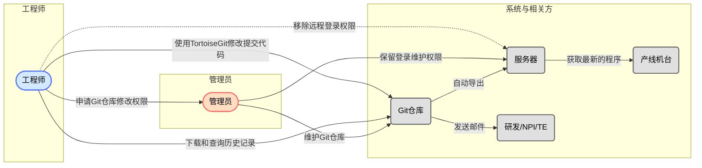
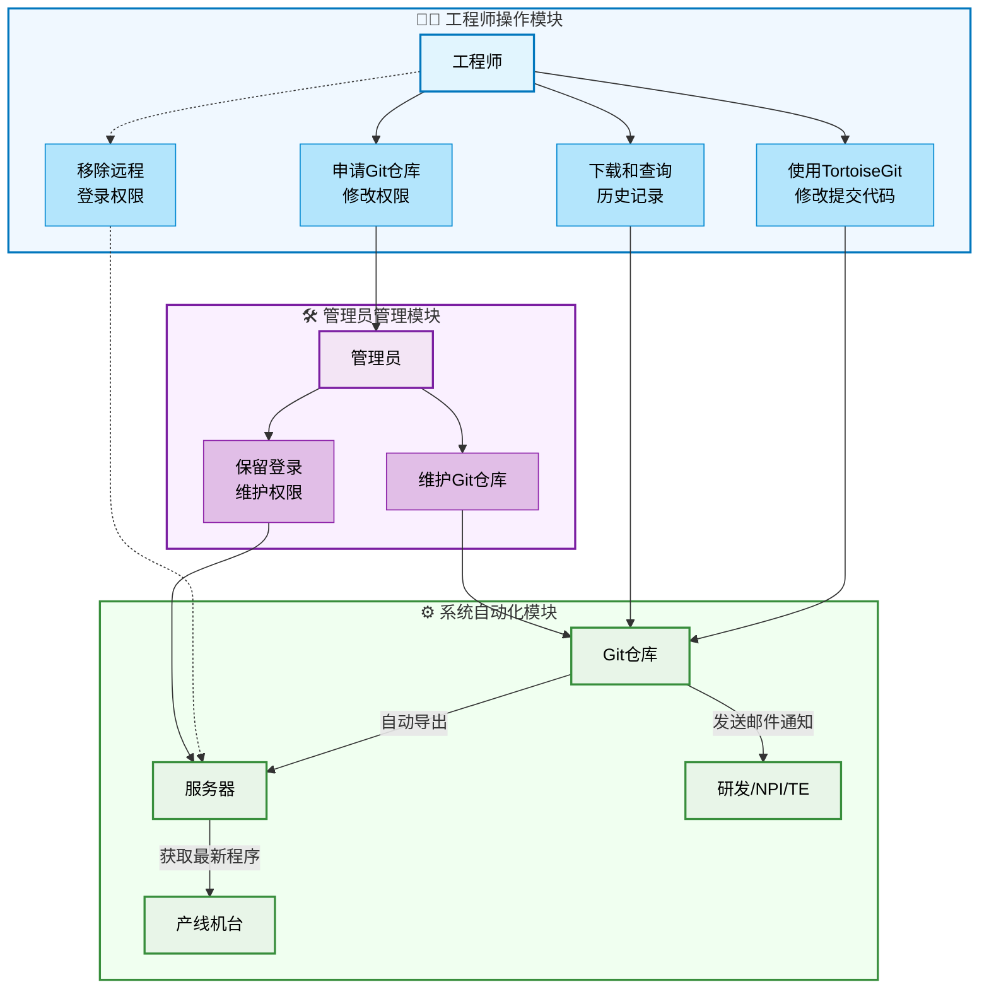
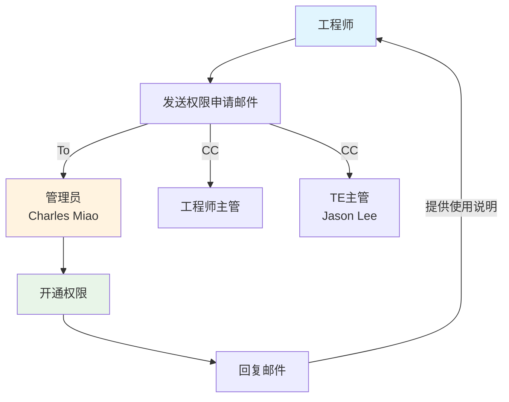

# Gitea+LFS

## 项目由来

- 以前使用SVN管理测试程式的变更记录，但是SVN有一个局限（无法处理2GB以上的文件）。故而引入自建Git服务器+LFS功能（Large File Storage）

## Gogs、Gitblit、Gitea对比（Gemini AI）

Gitblit、Gitea 和Gogs 都是自建Git 服务器的选择，它们各有优缺点。Gitblit 适合Java 开发者，Gitea 是Gogs 的分支，功能更全面，而Gogs 则以轻量、易用著称。

### Gitblit:
- 优点:基于Java 开发，适合已经熟悉Java 的开发者，界面友好，在Windows 环境下部署方便。
- 缺点:功能相对简单，主要提供代码仓库管理和基础权限控制，对一些高级功能支持不足，社区不如Gitea 活跃。

### Gitea:
- 优点:基于Go 语言开发，轻量级，跨平台，安装和升级方便，功能全面，包括CI/CD、代码审查、项目管理等，社区活跃，更新频繁。
- 缺点:相对Gogs，资源占用略高，但在同类产品中仍然算轻量级。

### Gogs:
- 优点:非常轻量级，资源占用极低，安装简单，部署方便，核心功能完善，适合对服务器资源有严格要求的场景。
- 缺点:功能相对Gitea 较少，社区活跃度不如Gitea。

### 总结:
- 如果追求极致的轻量级和简单易用，Gogs 是一个不错的选择。
- 如果需要更全面的功能和活跃的社区支持，Gitea 更好。
- 如果已经熟悉Java 语言，并且需要在Windows 环境下部署，Gitblit 可以考虑。

## [横向对比 Gitea 与其它 Git 托管工具](https://docs.gitea.com/zh-cn/1.19/installation/comparison)
- Gitea功能比Gogs多很多

## [Gogs、Gitblit、Gitea、GitLab对比](https://zhuanlan.zhihu.com/p/1887851467412578612)

> |工具|语言/架构|核心特点|适用场景
> |--|--|--|--|
> |Gogs|	Go（单二进制）|	极轻量、资源占用极低、安装简单；功能基础（代码托管、权限管理、Web Hook）|	超小型团队或个人开发者
> |Gitblit|	Java|	轻量、支持图形化界面、适合Windows部署；功能简单（仓库管理、基础权限）|	需要简单界面操作的小团队
> |Gitea|	Go（Gogs分支）|	轻量但功能更全面（CI/CD、代码审查、项目管理、制品库）；社区活跃，更新频繁|	需要轻量但功能较全的团队
> |GitLab|	Ruby|	功能全面（全周期DevOps、CI/CD、看板、Wiki）；资源消耗高，配置复杂|	中大型团队或复杂项目

### 总结建议
- 首选Gitea：功能与轻量化的最佳平衡，适合大多数小型团队。
- 次选Gog：若团队仅需最基础的代码托管且资源极度有限。
- 避免GitLab：除非明确需要复杂功能且能承担运维成本。

## 首选Gitea

### 安装和使用说明：

- 服务器安装Gitea参见：[服务器（Windows系统）自建git服务器超详细教程](https://www.cnblogs.com/alexgl2008/articles/17948253)
- 自动导出脚本[GitCheckOut](https://github.com/Charles-Miao/Python-in-Action/tree/master/2025/Gitea+LFS/GitCheckOut)，命令行指令参见：[常用 Git 命令清单](https://www.ruanyifeng.com/blog/2015/12/git-cheat-sheet.html)
- [Gitea自带邮件通知](https://blog.csdn.net/huyuchengus/article/details/128475776)无法实现Commit Notifier，故而自行编写[CheckGit](https://github.com/Charles-Miao/Python-in-Action/tree/master/2025/Gitea+LFS/CheckGit)实现之
- 客户端使用说明参见：[测试程式版本控制系统说明.pptx](https://github.com/Charles-Miao/Python-in-Action/tree/master/2025/Gitea+LFS/测试程式版本控制系统说明.pptx)

### 流程说明：
1. SW工程师透过TortoiseGit将testtool/ testimage/ ATOtools/ Shippingimage/ BOIS等文件上传到Git仓库中
2. Git仓库自动导出到服务器中，同时发送邮件给相关人员，以便了解变更记录
3. 产线device从服务器获取最新的tool/ image/ BIOS等文件
4. 去除工程师远程登录权限，只保留管理员登录服务器配置和维护相关设定
5. 工程师需要修改程式权限，则找TE管理员申请
6. 透过Git软件可以下载，修改，提交程序代码，同时可以查询修改记录

### 流程图（Gemini）

### 流程图（Claude）

### 流程图（权限申请）

