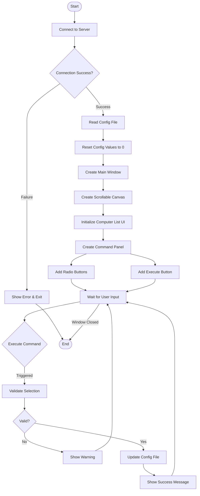
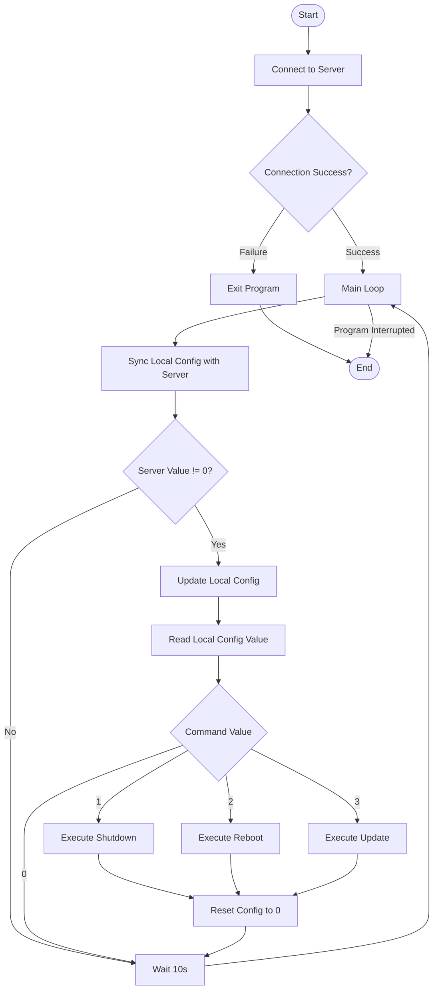

<!-- Server 流程图 -->
## Server

```mermaid
flowchart TD
    A([Start]) --> B[Connect to Server]
    B --> C{Connection Success?}
    C -->|Failure| D[Show Error & Exit]
    C -->|Success| E[Read Config File]
    E --> F[Reset Config Values to 0]
    F --> G[Create Main Window]
    G --> H[Create Scrollable Canvas]
    H --> I[Initialize Computer List UI]
    
    I --> J[Create Command Panel]
    J --> K[Add Radio Buttons]
    J --> L[Add Execute Button]
    
    K --> M[Wait for User Input]
    L --> M
    
    M --> N{Execute Command}
    N -->|Triggered| O[Validate Selection]
    O --> P{Valid?}
    P -->|No| Q[Show Warning]
    P -->|Yes| R[Update Config File]
    R --> S[Show Success Message]
    
    Q --> M
    S --> M
    D --> Z([End])
    M -->|Window Closed| Z
```

<!-- Client 流程图 -->

## Client

```mermaid
flowchart TD
    A([Start]) --> B[Connect to Server]
    B --> C{Connection Success?}
    C -->|Failure| D[Exit Program]
    C -->|Success| E[Main Loop]
    
    E --> F[Sync Local Config with Server]
    F --> G{Server Value != 0?}
    G -->|Yes| H[Update Local Config]
    G -->|No| I[Wait 10s]
    
    H --> J[Read Local Config Value]
    J --> K{Command Value}
    K -->|1| L[Execute Shutdown]
    K -->|2| M[Execute Reboot]
    K -->|3| N[Execute Update]
    K -->|0| I
    
    L --> O[Reset Config to 0]
    M --> O
    N --> O
    O --> I
    I --> E
    
    D --> Z([End])
    E -->|Program Interrupted| Z
```