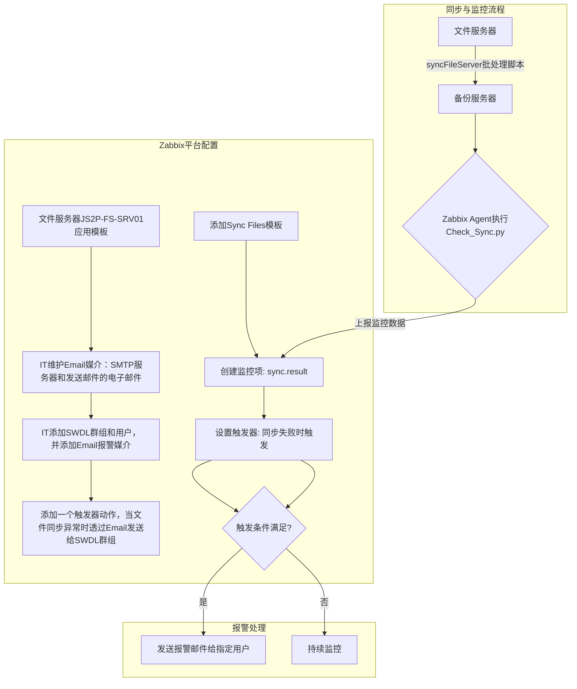

```mermaid
flowchart TD
    subgraph 同步与监控流程
        A[文件服务器] -->|syncFileServer批处理脚本| B[备份服务器]
        B --> C{Zabbix Agent执行Check_Sync.py}
    end

    subgraph Zabbix平台配置
        D[添加Sync Files模板] --> E[创建监控项: sync.result]
        E --> F[设置触发器: 同步失败时触发]
        G[文件服务器JS2P-FS-SRV01应用模板] --> H[IT维护Email媒介：SMTP服务器和发送邮件的电子邮件]
        H --> I[IT添加SWDL群组和用户，并添加Email报警媒介]
        I --> J[添加一个触发器动作，当文件同步异常时透过Email发送给SWDL群组]
        F --> K{触发条件满足?}
    end

    subgraph 报警处理
        K -->|是| L[发送报警邮件给指定用户]
        K -->|否| M[持续监控]
    end

    C -->|上报监控数据| E
    F --> K
```